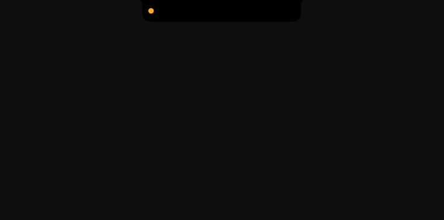
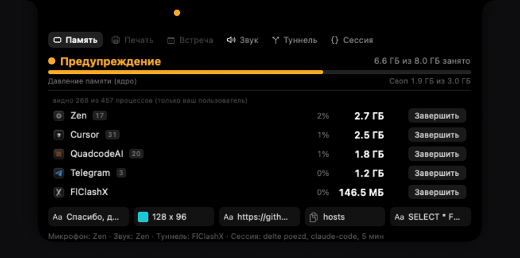
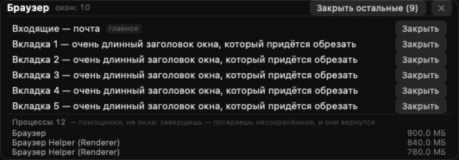

<div align="center">



[](https://github.com/borissharikoff-droid/MacPulse/actions/workflows/build.yml)
[](https://github.com/borissharikoff-droid/MacPulse/releases/latest)


</div>

```bash
curl -fsSL https://raw.githubusercontent.com/borissharikoff-droid/MacPulse/main/install.sh | bash
```

<sup>macOS 13+ · Apple Silicon and Intel · no Gatekeeper dialogs · **the app's UI is in Russian**</sup>

<details><summary>Why a terminal command and not the .dmg</summary><br>

Ad-hoc signed, so since macOS 15 Finder will not open it at all. Quarantine is set by whatever downloads the file, and `curl` does not set it — so this lands a working copy with no dialog. The installer checks the bundle id, the signature and your CPU's slice, never uses `sudo`, and leaves what you have untouched if any check fails. A `.dmg` is attached to [every release](https://github.com/borissharikoff-droid/MacPulse/releases/latest).

**Uninstall:** `curl -fsSL …/install.sh | bash -s -- --uninstall`

</details>

---

### Hover the notch



### One click per section



### Close windows, not processes



---

<div align="center">
<sub>Offscreen renders of the shipping view tree — not screen recordings.</sub><br><br>
<sub><a href="docs/README.ru.md">Docs (RU)</a> · <a href="CHANGELOG.md">Changelog</a> · <a href="CONTRIBUTING.md">Contributing</a> · <a href="SECURITY.md">Security</a> · MIT</sub>
</div>
